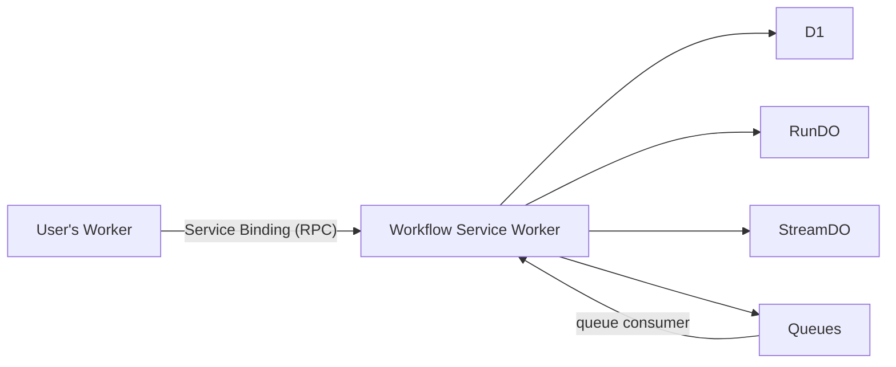

# Architecture

This page explains how Workflow DevKit concepts map to Cloudflare resources, the two-worker architecture, and why each design choice was made.

## Two-worker architecture

The Cloudflare world uses two workers connected by a Service Binding:



### User's Worker

Written by you. A normal Cloudflare Worker wrapped with `withWorkflow()`. Uses `start()` and `getRun()` from `workflow/api` to interact with workflows. Has no direct access to D1, Durable Objects, or Queues -- all workflow operations go through the Service Binding.

### Workflow Service Worker (generated)

Fully generated by `workflow-cloudflare build`. Owns all workflow infrastructure:

- **Durable Objects** for per-run state and streaming
- **D1** for the global run index
- **Queues** for workflow/step scheduling
- **RPC entrypoint** for the proxy world (called by your worker)
- **Auth-gated HTTP endpoints** for inspect and webhooks

This is analogous to Vercel's VQS -- invisible infrastructure that the user never touches.

### Why two workers?

Separating concerns provides:

- **Clean DX**: Your worker code uses `withWorkflow()`, `start()`, and `getRun()` with no infrastructure boilerplate
- **Security**: Workflow infrastructure (D1, DOs, Queues) is not exposed to your application's request surface
- **Independent scaling**: The service worker scales based on workflow load, your worker scales based on user traffic
- **Framework agnostic**: `withWorkflow()` wraps any Worker export (raw, Hono, Itty Router, etc.)

## Resource mapping

| Workflow DevKit | Cloudflare Resource |
|---|---|
| Storage (per-run state) | Durable Object (RunDO) with SQLite |
| Storage (global index) | D1 database |
| Queue (scheduling) | Cloudflare Queues |
| Streaming | Durable Object (StreamDO) with SQLite |
| World proxy | Service Binding (RPC) |
| Polyfills | Build-time module aliasing (esbuild) |

## Storage: D1 + Durable Objects

### RunDO (per-run state)

Each workflow run gets its own Durable Object instance (`WorkflowRunDO`). The DO's internal SQLite database stores:

- Run metadata (status, workflow name, input/output, timestamps)
- Event log (append-only event sourcing)
- Step results
- Hook registrations
- Wait conditions

The single-threaded nature of a Durable Object guarantees serialized event processing per run -- no external transactions or locking needed.

### D1 (global index)

A D1 database provides the global index across all runs. It stores denormalized copies of run metadata, steps, hooks, and stream references. This enables cross-run queries like "list all running workflows."

The D1 index is updated asynchronously via `waitUntil`, so it is eventually consistent. Single-run lookups always go through the RunDO for strong consistency.

### Why both?

D1 alone cannot provide per-run transactional guarantees (no row-level locking). Durable Objects alone have no cross-instance queries. Together they provide both strong per-run consistency and global queryability.

## Scheduling: Cloudflare Queues

Two queues handle all workflow and step invocations:

- `{app-name}-workflow-runs` -- workflow function invocations
- `{app-name}-workflow-steps` -- step function invocations

### Delay chaining for long sleeps

Cloudflare Queues cap delays at 24 hours. For longer sleeps, the queue consumer re-enqueues with capped delays until the target time:

```
sleep(72 hours)
  --> enqueue with delay 24h
  --> consumer wakes, re-enqueues with delay 24h
  --> consumer wakes, re-enqueues with delay 24h
  --> consumer wakes, resumeAt reached, execute
```

This is transparent to user code.

## Streaming: StreamDO

Each stream gets its own `WorkflowStreamDO` instance with SQLite-backed chunk storage and real-time notification for readers. Stream metadata is indexed in D1.

## Service Binding communication

The `CloudflareProxyWorld` in your worker implements the full `World` interface by proxying all operations through the Service Binding's RPC interface:

| Operation | RPC Method |
|---|---|
| `world.events.create()` | `service.eventsCreate()` |
| `world.runs.get()` | `service.runsGet()` |
| `world.queue()` | `service.enqueue()` |
| `world.readFromStream()` | `service.readFromStream()` |

The `WorkflowServiceEntrypoint` in the service worker receives these RPC calls and delegates to the actual Cloudflare World implementation.

## Polyfill approach

The Workflow DevKit core uses Node.js and Vercel-specific APIs. Build-time module aliasing replaces them:

| Module | Polyfill Strategy |
|---|---|
| `node:vm` | Pre-imported workflow function lookup from a global map |
| `node:module` | No-op `createRequire` |
| `@vercel/functions` | Delegates `waitUntil` to Cloudflare's `ExecutionContext` |
| `cbor-x` | Aliased to no-eval variant |

This approach requires zero modifications to `@workflow/core`. See [Security](/security) for details.

## Build output

After `workflow-cloudflare build`:

```
dist/
  service-worker/          # Generated workflow service worker
    _worker.js             # Entry with DOs, queue handler, RPC entrypoint
    _vm-polyfill.js        # node:vm polyfill
    wrangler.toml          # Service worker wrangler config
  client.js                # Client library with .workflowId stubs
  step-handler.js          # Step execution handler
  flow-handler.js          # Workflow orchestration handler
.well-known/
  workflow/v1/
    manifest.json          # Workflow manifest
wrangler.toml              # User worker config (with Service Binding)
```
