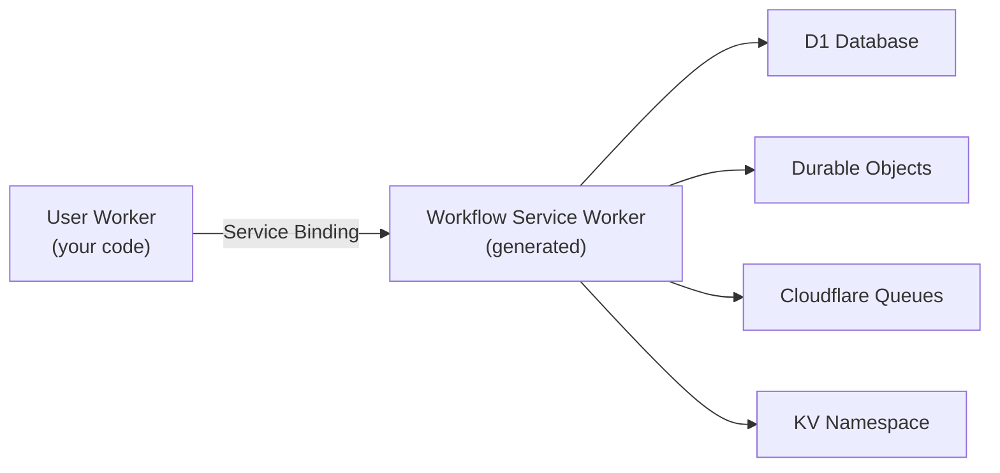

# Tutorial: User Onboarding (Bare Worker + CLI)

This tutorial builds a durable user onboarding workflow on Cloudflare Workers using a raw Worker and the `workflow-cloudflare` CLI.

## What you'll build

A multi-step onboarding flow that:

1. Creates a user account in KV
2. Sends a welcome email
3. Waits 10 seconds, then sends onboarding tips
4. Waits 15 seconds, then checks if the user activated
5. Sends a celebration or re-engagement email based on activation status
6. Returns a summary of the onboarding process

The workflow uses durable `sleep()` for delays, automatic retries for transient failures, and `FatalError` for permanent failures.

## Architecture



Your application worker communicates with the generated workflow service worker through a Cloudflare Service Binding. All workflow infrastructure (D1, Durable Objects, Queues) is owned by the service worker.

## Project setup

```bash
mkdir user-onboarding && cd user-onboarding
npm init -y
npm add workflow workflow-world-cloudflare @workflow/errors @workflow/world zod
npm add -D @cloudflare/workers-types wrangler
```

Add build and dev scripts to `package.json`:

```json
{
  "scripts": {
    "build": "workflow-cloudflare build --name user-onboarding",
    "dev": "workflow-cloudflare dev"
  },
  "imports": {
    "#workflows": "./dist/client.js"
  }
}
```

The `#workflows` import map points to the generated client library, which provides type-safe workflow function stubs.

## Write the workflow

Create `workflows/onboard-user.ts`:

```ts
import { FatalError, sleep } from "workflow";
import { getCloudflareEnv } from "workflow-world-cloudflare";

interface OnboardingInput {
  email: string;
  simulateActivation?: boolean;
}

interface User {
  id: string;
  email: string;
}

export async function onboardUser(input: OnboardingInput) {
  "use workflow";

  const user = await createUser(input.email);
  await sendEmail(user, "welcome");

  await sleep("10s");
  await sendEmail(user, "onboarding-tips");

  await sleep("15s");
  const activated = await checkActivation(user.id, input.simulateActivation);

  if (activated) {
    await sendEmail(user, "celebration");
  } else {
    await sendEmail(user, "re-engagement");
  }

  const emailsSent = await getEmailLog(user.id);
  return { userId: user.id, activated, emailsSent };
}

async function createUser(email: string): Promise<User> {
  "use step";

  if (!email?.includes("@")) {
    throw new FatalError("Invalid email address");
  }

  const env = getCloudflareEnv<{ USERS: KVNamespace }>();
  const id = crypto.randomUUID();
  const user = { id, email };

  await env.USERS.put(
    id,
    JSON.stringify({
      ...user,
      activated: false,
      createdAt: new Date().toISOString(),
    }),
  );

  return user;
}

async function sendEmail(user: User, type: string): Promise<void> {
  "use step";

  if (type === "welcome" && Math.random() < 0.3) {
    throw new Error("Email service temporarily unavailable");
  }

  const env = getCloudflareEnv<{ USERS: KVNamespace }>();
  const key = `emails:${user.id}`;
  const existing = (await env.USERS.get<string[]>(key, "json")) ?? [];
  existing.push(type);
  await env.USERS.put(key, JSON.stringify(existing));
}

async function checkActivation(
  userId: string,
  simulateActivation?: boolean,
): Promise<boolean> {
  "use step";

  const env = getCloudflareEnv<{ USERS: KVNamespace }>();
  const record = await env.USERS.get<{ activated: boolean }>(userId, "json");
  return simulateActivation ?? record?.activated ?? false;
}

async function getEmailLog(userId: string): Promise<string[]> {
  "use step";

  const env = getCloudflareEnv<{ USERS: KVNamespace }>();
  return (await env.USERS.get<string[]>(`emails:${userId}`, "json")) ?? [];
}
```

Key patterns:

- **`"use workflow"`** marks the top-level orchestration function
- **`"use step"`** marks each I/O operation as a durable step
- **`sleep("10s")`** creates a durable delay (survives restarts)
- **`FatalError`** prevents retries for permanent failures (invalid email)
- **`throw new Error()`** triggers automatic retries (transient email failure)
- **`getCloudflareEnv()`** accesses Cloudflare bindings inside steps

## Write the worker

Create `src/worker.ts`:

```ts
import { withWorkflow } from "workflow-world-cloudflare/with-workflow";
import { start, getRun } from "@workflow/core/runtime";
import { onboardUser } from "#workflows";

export default withWorkflow({
  async fetch(request, env, ctx) {
    const url = new URL(request.url);

    if (url.pathname === "/start" && request.method === "POST") {
      const body = await request.json();
      const run = await start(onboardUser, [body]);
      return Response.json({ runId: run.runId });
    }

    if (url.pathname === "/status" && request.method === "GET") {
      const runId = url.searchParams.get("runId");
      if (!runId) {
        return Response.json({ error: "Missing runId" }, { status: 400 });
      }
      const run = getRun(runId);
      const status = await run.status;
      const output = status === "completed" ? await run.output : undefined;
      return Response.json({ runId, status, output });
    }

    return new Response("User Onboarding API\n\nPOST /start\nGET /status?runId=...");
  },
});
```

The `withWorkflow()` wrapper:

- Creates a proxy world from the `WORKFLOW` Service Binding
- Calls `setWorld()` internally so `start()` and `getRun()` work
- Wraps your fetch handler with the necessary `AsyncLocalStorage` contexts

The `#workflows` import resolves to the generated client library, which provides the `onboardUser` function with its `.workflowId` attached for type-safe invocation via `start()`.

## Configure custom bindings

Create `wrangler.app.toml` for your custom KV binding:

```toml
main = "src/worker.ts"

[[kv_namespaces]]
binding = "USERS"
id = "user-onboarding-kv"

[vars]
WORKFLOW_INSPECT_TOKEN = "dev-secret"
```

The builder merges this with the generated base config, which includes the `WORKFLOW` Service Binding.

## Build

```bash
npm run build
```

This produces:

```
dist/
  service-worker/        # Generated workflow service worker
    _worker.js           # Entry with DOs, queue handler, RPC entrypoint
    wrangler.toml        # Service worker config
  client.js              # Client library with workflow stubs
  step-handler.js        # Step execution handler
  flow-handler.js        # Workflow orchestration handler
.well-known/
  workflow/v1/
    manifest.json        # Workflow manifest
wrangler.toml            # Your worker config (with Service Binding)
```

## Run locally

```bash
npm run dev
```

This starts both workers:

- **Service worker** on port 8787 (handles all workflow infrastructure)
- **Your worker** on port 8788 (your application code)

## Test

Trigger a workflow:

```bash
curl -X POST http://localhost:8788/start \
  -H 'Content-Type: application/json' \
  -d '{"email": "alice@example.com", "simulateActivation": true}'
```

Poll for status:

```bash
curl "http://localhost:8788/status?runId=<runId>"
```

## Inspect

Use the inspect CLI against the service worker:

```bash
npx workflow-cloudflare inspect runs \
  --url http://localhost:8787 \
  --token dev-secret
```

## Deploy

Create Cloudflare resources, then deploy both workers:

```bash
wrangler d1 create user-onboarding-workflow-db
wrangler queues create user-onboarding-workflow-runs
wrangler queues create user-onboarding-workflow-steps

# Deploy service worker
wrangler deploy -c dist/service-worker/wrangler.toml

# Deploy your worker
wrangler deploy
```

## Next steps

- [Hono + Vite Tutorial](/tutorials/user-onboarding-hono-vite) -- Same workflow with a framework and Vite
- [Custom Bindings](/configuration/custom-bindings) -- Add more Cloudflare services
- [Architecture](/architecture/) -- Understand the two-worker model
