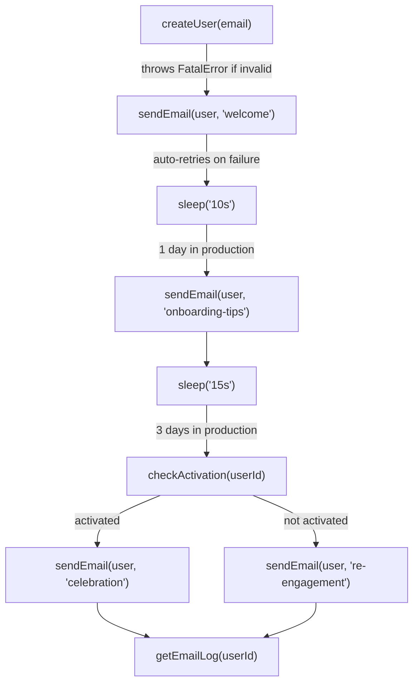

# Tutorial: User Onboarding Workflow

In this tutorial you'll build a durable user onboarding workflow that runs on Cloudflare Workers. When a user signs up, the workflow creates their account, sends a welcome email, waits a day, sends onboarding tips, waits three more days, checks whether the user has activated, and sends either a celebration or a re-engagement email. Because each step is durable, this workflow survives Worker restarts, deploys, and transient failures -- even though it spans days.

## What you'll learn

- Defining workflows and steps with `"use workflow"` and `"use step"`
- Pausing a workflow with `sleep()` without consuming compute
- Failing fast with `FatalError` (no retries)
- Automatic retries when a step throws a regular error
- Accessing Cloudflare bindings (KV) from step functions with `getCloudflareEnv()`
- Adding custom bindings via `wrangler.app.toml`
- Building with the `workflow-cloudflare` CLI
- Running locally with `wrangler dev`
- Inspecting workflow runs with `workflow-cloudflare inspect`

## The workflow at a glance



The sleeps are short (10 s, 15 s) so you can test locally in under a minute. `sleep()` handles any duration -- days, weeks -- without consuming compute.

## Prerequisites

- Node.js 18+
- [wrangler CLI](https://developers.cloudflare.com/workers/wrangler/install-and-update/) (`npm i -g wrangler`)
- A Cloudflare account (Workers Paid plan for production -- local dev is free)

## Create the project

```bash
mkdir user-onboarding && cd user-onboarding
npm init -y
```

Install the runtime packages and dev tools:

```bash
npm add workflow workflow-world-cloudflare
npm add -D wrangler @cloudflare/workers-types
```

Create a `tsconfig.json`:

```json
{
  "compilerOptions": {
    "target": "ES2022",
    "module": "ES2022",
    "moduleResolution": "bundler",
    "strict": true,
    "esModuleInterop": true,
    "skipLibCheck": true,
    "types": ["@cloudflare/workers-types"]
  },
  "include": ["workflows/**/*.ts"]
}
```

## Write the workflow

Create `workflows/onboard-user.ts`. We'll build it up step by step.

### The workflow function

Start with the orchestrator. The `"use workflow"` directive marks this function as a durable workflow -- its execution is recorded and can be replayed across restarts.

```ts
export async function onboardUser(input: OnboardingInput) {
  "use workflow";

  const user = await createUser(input.email);
  await sendEmail(user, "welcome");

  await sleep("10s");
  await sendEmail(user, "onboarding-tips");

  await sleep("15s");
  const activated = await checkActivation(user.id, input.simulateActivation);

  if (activated) {
    await sendEmail(user, "celebration");
  } else {
    await sendEmail(user, "re-engagement");
  }

  const emailsSent = await getEmailLog(user.id);
  return { userId: user.id, activated, emailsSent };
}
```

Everything inside a workflow function must be deterministic -- no direct I/O. All real work happens in step functions, which the workflow calls with `await`.

`sleep("10s")` suspends the workflow for 10 seconds. In production you'd use `sleep("1 day")` or `sleep("3 days")`. The workflow doesn't consume any compute while sleeping -- it's durably paused and resumed by the infrastructure.

### The `createUser` step

Step functions do the real work. The `"use step"` directive makes the function durable -- its result is persisted, and if the Worker restarts, the workflow replays the recorded result instead of re-running the step.

```ts
async function createUser(email: string): Promise<User> {
  "use step";

  if (!email?.includes("@")) {
    throw new FatalError("Invalid email address");
  }

  const env = getCloudflareEnv<{ USERS: KVNamespace }>();
  const id = crypto.randomUUID();
  const user = { id, email };

  await env.USERS.put(
    id,
    JSON.stringify({
      ...user,
      activated: false,
      createdAt: new Date().toISOString(),
    }),
  );

  console.log(`User created: ${id} (${email})`);
  return user;
}
```

Three things to notice:

1. **`FatalError`** -- Throwing a `FatalError` immediately fails the workflow with no retries. Use it when retrying can't help (e.g. invalid input).

2. **`getCloudflareEnv()`** -- Gives step functions access to Cloudflare bindings (KV, D1, R2, AI, etc.). The type parameter tells TypeScript which bindings you expect.

3. **`console.log`** -- Logs appear in your `wrangler dev` terminal, giving you real-time visibility into each step.

### The `sendEmail` step

This step simulates a flaky email service. When the welcome email is sent, there's a 30% chance it throws a regular `Error`. Unlike `FatalError`, regular errors trigger automatic retries -- the step will be retried until it succeeds.

Each email is also written to a KV "outbox" so you can verify which emails were sent.

```ts
async function sendEmail(user: User, type: string): Promise<void> {
  "use step";

  console.log(`Sending ${type} email to ${user.email}...`);

  if (type === "welcome" && Math.random() < 0.3) {
    throw new Error("Email service temporarily unavailable");
  }

  const env = getCloudflareEnv<{ USERS: KVNamespace }>();
  const key = `emails:${user.id}`;
  const existing = (await env.USERS.get<string[]>(key, "json")) ?? [];
  existing.push(type);
  await env.USERS.put(key, JSON.stringify(existing));

  console.log(`${type} email sent to ${user.email}.`);
}
```

### The `checkActivation` step

After the second sleep, the workflow checks whether the user has activated. This reads from KV and also accepts an optional `simulateActivation` flag so you can test both branches easily.

```ts
async function checkActivation(
  userId: string,
  simulateActivation?: boolean,
): Promise<boolean> {
  "use step";

  const env = getCloudflareEnv<{ USERS: KVNamespace }>();
  const record = await env.USERS.get<{ activated: boolean }>(userId, "json");
  const activated = simulateActivation ?? record?.activated ?? false;
  console.log(`Activation check for ${userId}: ${activated}`);
  return activated;
}
```

### The `getEmailLog` step

A small utility step that reads the KV outbox and returns the list of emails sent, which gets included in the workflow's return value.

```ts
async function getEmailLog(userId: string): Promise<string[]> {
  "use step";

  const env = getCloudflareEnv<{ USERS: KVNamespace }>();
  return (await env.USERS.get<string[]>(`emails:${userId}`, "json")) ?? [];
}
```

### Complete file

Here's the full `workflows/onboard-user.ts`:

```ts
import { FatalError, sleep } from "workflow";
import { getCloudflareEnv } from "workflow-world-cloudflare";

interface OnboardingInput {
  email: string;
  simulateActivation?: boolean;
}

interface User {
  id: string;
  email: string;
}

export async function onboardUser(input: OnboardingInput) {
  "use workflow";

  const user = await createUser(input.email);
  await sendEmail(user, "welcome");

  await sleep("10s");
  await sendEmail(user, "onboarding-tips");

  await sleep("15s");
  const activated = await checkActivation(user.id, input.simulateActivation);

  if (activated) {
    await sendEmail(user, "celebration");
  } else {
    await sendEmail(user, "re-engagement");
  }

  const emailsSent = await getEmailLog(user.id);
  return { userId: user.id, activated, emailsSent };
}

async function createUser(email: string): Promise<User> {
  "use step";

  if (!email?.includes("@")) {
    throw new FatalError("Invalid email address");
  }

  const env = getCloudflareEnv<{ USERS: KVNamespace }>();
  const id = crypto.randomUUID();
  const user = { id, email };

  await env.USERS.put(
    id,
    JSON.stringify({
      ...user,
      activated: false,
      createdAt: new Date().toISOString(),
    }),
  );

  console.log(`User created: ${id} (${email})`);
  return user;
}

async function sendEmail(user: User, type: string): Promise<void> {
  "use step";

  console.log(`Sending ${type} email to ${user.email}...`);

  if (type === "welcome" && Math.random() < 0.3) {
    throw new Error("Email service temporarily unavailable");
  }

  const env = getCloudflareEnv<{ USERS: KVNamespace }>();
  const key = `emails:${user.id}`;
  const existing = (await env.USERS.get<string[]>(key, "json")) ?? [];
  existing.push(type);
  await env.USERS.put(key, JSON.stringify(existing));

  console.log(`${type} email sent to ${user.email}.`);
}

async function checkActivation(
  userId: string,
  simulateActivation?: boolean,
): Promise<boolean> {
  "use step";

  const env = getCloudflareEnv<{ USERS: KVNamespace }>();
  const record = await env.USERS.get<{ activated: boolean }>(userId, "json");
  const activated = simulateActivation ?? record?.activated ?? false;
  console.log(`Activation check for ${userId}: ${activated}`);
  return activated;
}

async function getEmailLog(userId: string): Promise<string[]> {
  "use step";

  const env = getCloudflareEnv<{ USERS: KVNamespace }>();
  return (await env.USERS.get<string[]>(`emails:${userId}`, "json")) ?? [];
}
```

## Add custom bindings

The workflow uses a KV namespace called `USERS`. Create a `wrangler.app.toml` file at the project root to declare it:

```toml
main = "src/worker.ts"

[[kv_namespaces]]
binding = "USERS"
id = "user-onboarding-kv"

[vars]
WORKFLOW_INSPECT_TOKEN = "dev-secret"
```

The builder merges this file with the generated `wrangler.toml`, so your custom bindings sit alongside the required workflow bindings (D1, Durable Objects, Queues). See [Configuration](/configuration/) for details on the merge behavior.

Setting `main = "src/worker.ts"` overrides the builder's default entry point so we can add our own HTTP routes (next section).

The `WORKFLOW_INSPECT_TOKEN` variable enables the inspect CLI, which we'll use later to query workflow runs.

::: tip
The `wrangler.app.toml` file is version-controlled. The generated `wrangler.toml` is builder-owned and should be gitignored.
:::

## Write the Worker entry point

The builder generates the internal workflow plumbing, but your Worker needs its own HTTP routes to trigger and monitor workflows. Create `src/worker.ts`:

```ts
import { setWorld } from "@workflow/core/runtime";
import { start } from "@workflow/core/runtime/start";
import { createWorkerHandlers } from "workflow-world-cloudflare";
export { WorkflowRunDO, WorkflowStreamDO } from "workflow-world-cloudflare/durable-objects";

import "../dist/step-handler.js";

const flow = await import("../dist/flow-handler.js").then((m) => m.POST);
const step = await import("../dist/step-handler.js").then((m) => m.POST);
const manifest = await import("../.well-known/workflow/v1/manifest.json");

const handlers = createWorkerHandlers({
  setWorld,
  flow,
  step,
  manifest: manifest.default || manifest,

  onUnmatched: async (request, _env, world) => {
    const url = new URL(request.url);

    if (request.method === "POST" && url.pathname === "/start") {
      const body: { workflowName: string; input?: unknown } = await request.json();
      const fns = (globalThis as Record<string, unknown>).__workflow_cloudflare_functions as
        | Map<string, (...args: unknown[]) => unknown>
        | undefined;

      let workflowFn = fns?.get(body.workflowName);
      if (!workflowFn) {
        for (const [key, fn] of fns || []) {
          if (key.endsWith("//" + body.workflowName)) {
            workflowFn = fn;
            break;
          }
        }
      }
      if (!workflowFn) {
        return Response.json(
          { error: "Unknown workflow: " + body.workflowName },
          { status: 404 },
        );
      }

      const run = await start(workflowFn, body.input != null ? [body.input] : []);
      return Response.json({ runId: run.runId });
    }

    if (request.method === "GET" && url.pathname === "/status") {
      const runId = url.searchParams.get("runId");
      if (!runId)
        return Response.json({ error: "Missing runId parameter" }, { status: 400 });
      try {
        const run = await world.runs.get(runId);
        const { input, output, executionContext, ...rest } =
          run as Record<string, unknown>;
        return Response.json(rest);
      } catch (e) {
        return Response.json({ error: String(e) }, { status: 404 });
      }
    }

    return new Response("Not Found", { status: 404 });
  },
});

export default handlers;
```

`createWorkerHandlers` wires up the world, `envStorage`, `executionContextStorage`, queue processing, inspect routes, and the internal `/.well-known/` routes. Your code only needs to handle your application's routes in `onUnmatched`.

::: warning
The `/start` and `/status` endpoints above have no authentication. In a production deployment you'd add your own auth middleware -- API keys, JWTs, Cloudflare Access, etc. -- before calling `start()` or `world.runs.get()`.
:::

## Build for Cloudflare

```bash
npx workflow-cloudflare build --name user-onboarding
```

This scans your project for `"use workflow"` and `"use step"` directives, compiles the workflow and step bundles, and generates:

- `dist/step-handler.js`, `dist/flow-handler.js` -- compiled handlers
- `wrangler.toml` -- the merged config with all required bindings

## Run locally

```bash
wrangler dev
```

Wrangler starts a local server (the port is printed in the output). Miniflare simulates D1, Durable Objects, Queues, and KV -- no Cloudflare account needed for local development.

## Trigger the workflow

Open a second terminal and start a workflow run:

```bash
curl -s -X POST http://localhost:8787/start \
  -H 'Content-Type: application/json' \
  -d '{"workflowName": "onboardUser", "input": {"email": "alice@example.com"}}' | jq .
```

You'll get back a run ID:

```json
{
  "runId": "wrun_01JQ..."
}
```

Now watch your `wrangler dev` terminal. You'll see the steps execute in sequence, with visible pauses during each `sleep()`:

```
User created: abc-123 (alice@example.com)
Sending welcome email to alice@example.com...
welcome email sent to alice@example.com.
                                          ← 10 second pause
Sending onboarding-tips email to alice@example.com...
onboarding-tips email sent to alice@example.com.
                                          ← 15 second pause
Activation check for abc-123: false
Sending re-engagement email to alice@example.com...
re-engagement email sent to alice@example.com.
```

::: tip
If the welcome email step fails on the first attempt (the simulated 30% failure rate), you'll see the retry happen automatically -- the step is re-executed until it succeeds.
:::

## Poll for completion

Once the logs stop, poll the run status using the `/status` endpoint:

```bash
curl -s "http://localhost:8787/status?runId=<run-id>" | jq .
```

When the workflow completes:

```json
{
  "runId": "wrun_01JQ...",
  "status": "completed",
  "workflowName": "workflow//./workflows/onboard-user//onboardUser",
  "startedAt": "2026-03-19T10:08:59.730Z",
  "completedAt": "2026-03-19T10:09:38.910Z"
}
```

## Test the activated branch

Run the workflow again with `simulateActivation` set to `true`:

```bash
curl -s -X POST http://localhost:8787/start \
  -H 'Content-Type: application/json' \
  -d '{"workflowName": "onboardUser", "input": {"email": "bob@example.com", "simulateActivation": true}}' | jq .
```

This time the workflow takes the other branch. After the sleeps, you'll see:

```
Activation check for def-456: true
Sending celebration email to bob@example.com...
celebration email sent to bob@example.com.
```

## Test error handling

Send an invalid email to see `FatalError` in action:

```bash
curl -s -X POST http://localhost:8787/start \
  -H 'Content-Type: application/json' \
  -d '{"workflowName": "onboardUser", "input": {"email": "not-an-email"}}' | jq .
```

The workflow fails immediately -- no retries. Poll the status to confirm:

```json
{
  "runId": "wrun_01JQ...",
  "status": "failed",
  "error": {
    "message": "Invalid email address"
  }
}
```

Because `createUser` throws a `FatalError`, the workflow fails with no retries. Compare this with `sendEmail`, which throws a regular `Error` -- that step is automatically retried until it succeeds.

## Inspect the run

The `workflow-cloudflare inspect` CLI lets you query workflow runs, steps, and events. We enabled it earlier by setting `WORKFLOW_INSPECT_TOKEN` in `wrangler.app.toml`.

List all runs (replace the port with the one from your `wrangler dev` output):

```bash
npx workflow-cloudflare inspect runs \
  --url http://localhost:<port> \
  --token dev-secret
```

View the steps of a specific run:

```bash
npx workflow-cloudflare inspect steps \
  --run-id <run-id> \
  --url http://localhost:<port> \
  --token dev-secret
```

View the event history:

```bash
npx workflow-cloudflare inspect events \
  --run-id <run-id> \
  --url http://localhost:<port> \
  --token dev-secret
```

For deployed Workers, set the token as a secret instead of a plain-text variable:

```bash
wrangler secret put WORKFLOW_INSPECT_TOKEN
```

## What's happening under the hood

Each step runs as a separate HTTP request to the Worker. Between steps, the workflow's state is stored in a Durable Object with SQLite storage. `sleep()` enqueues a delayed message on Cloudflare Queues -- no compute is consumed while waiting. When the delay expires, the queue delivers the message and the workflow resumes from where it left off.

For long sleeps that exceed the 24-hour queue delay limit, the infrastructure automatically chains multiple delays until the target time is reached.

See [Architecture](/architecture/) for the full resource mapping.

## Next steps

- **Deploy to Cloudflare** -- Create the D1 database and Queues (`wrangler d1 create`, `wrangler queues create`), then `wrangler deploy`. See [Getting Started](/getting-started#create-cloudflare-resources).
- **Use real durations** -- Replace `sleep("10s")` with `sleep("1 day")` and `sleep("15s")` with `sleep("3 days")`.
- **Add more bindings** -- Connect to Hyperdrive, R2, Workers AI, or any other Cloudflare service. See [Custom Bindings](/configuration/custom-bindings).
- **Set up Vite** -- Get HMR and skip the manual build step during development. See [Vite Integration](/vite/project-setup).
